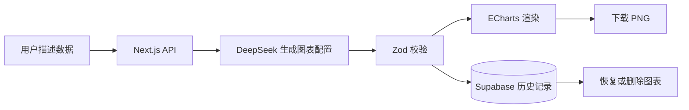

# AI Charts

用自然语言描述数据，自动生成清晰、可交互并可保存的图表。

[在线体验](https://ai-charts-blond.vercel.app/zh) | [English UI](https://ai-charts-blond.vercel.app/en)

## 项目简介

AI Charts 是一个基于大语言模型的可视化应用。用户只需要输入一段包含数据的自然语言描述，例如月度销量、预算构成或能力评分，应用便会识别数据结构并生成适合的图表。如果用户明确指定柱状图、折线图、饼图或雷达图等类型，应用会优先按指定类型渲染。

生成后的图表可以保存到历史记录、重新打开或下载为 PNG 图片，适合快速将散落在文字中的数据转为可阅读的视觉结果。

## 功能特性

- **自然语言生成图表**：通过 DeepSeek 解析描述并产出结构化 ECharts 配置。
- **多类型图表支持**：支持柱状图、折线图、饼图、雷达图等适合数据表达的图形。
- **历史记录**：将生成结果保存到 Supabase，支持浏览、重新加载与单条删除。
- **图片导出**：当前图表可直接下载为 PNG。
- **交互细节优化**：悬停时保持数据可见，历史图表切换不会发生图层叠加。
- **中英文界面**：内置中文与 English 切换。
- **响应式布局**：桌面端使用历史侧栏与图表工作区，小屏幕下保持可操作性。

## 工作流程



## 技术栈

| 分类 | 技术 |
| --- | --- |
| Web 应用 | Next.js 16, React 19, TypeScript |
| 样式与组件 | Tailwind CSS 4, shadcn/ui, Radix UI |
| 图表渲染 | Apache ECharts, echarts-for-react |
| AI 模型 | DeepSeek OpenAI-compatible API |
| 数据存储 | Supabase Postgres |
| 国际化 | next-intl |
| 部署 | Vercel |

## 本地运行

应用代码位于 `ai-charts/` 目录。

```bash
git clone https://github.com/CY-CPU1011/AI-Charts.git
cd AI-Charts/ai-charts
pnpm install
```

创建本地环境变量文件 `ai-charts/.env.local`：

```env
DEEPSEEK_API_KEY=your_deepseek_api_key
SUPABASE_URL=https://your-project.supabase.co
SUPABASE_SECRET_KEY=your_supabase_secret_key
```

可选设置：

```env
DEEPSEEK_BASE_URL=https://api.deepseek.com
DEEPSEEK_MODEL=deepseek-chat
```

然后启动开发服务：

```bash
pnpm dev
```

访问 [http://localhost:3000/zh](http://localhost:3000/zh)。

`SUPABASE_URL` 必须为项目根地址，不应追加 `/rest/v1`。数据库表 SQL 与更完整的配置说明见 [ai-charts/README.md](ai-charts/README.md)。

## 部署到 Vercel

1. 在 Vercel 中导入本仓库。
2. 将 **Root Directory** 设置为 `ai-charts`。
3. 为 Production 与 Preview 配置 `DEEPSEEK_API_KEY`、`SUPABASE_URL` 和 `SUPABASE_SECRET_KEY`。
4. 部署后访问 `/zh` 或 `/en`。

所有密钥均只用于服务端 Route Handlers；不要使用 `NEXT_PUBLIC_` 前缀，也不要将 `.env` 文件提交到 Git。

## 当前说明

当前版本未集成用户账号系统，历史记录为站点共享数据。若将项目作为公开服务长期使用，应增加身份认证，并将 `chart_history` 按用户进行隔离和授权控制。

## 项目目录

```text
AI-Charts/
├─ ai-charts/                  # Next.js 应用
│  ├─ app/api/                 # 图表生成与历史记录接口
│  ├─ components/              # 图表工作区和 UI 组件
│  └─ lib/                     # 数据契约、DeepSeek、ECharts、Supabase
├─ specs/001-prompt-to-chart/  # 功能规范与任务记录
└─ .specify/                   # Spec-driven 开发配置
```
